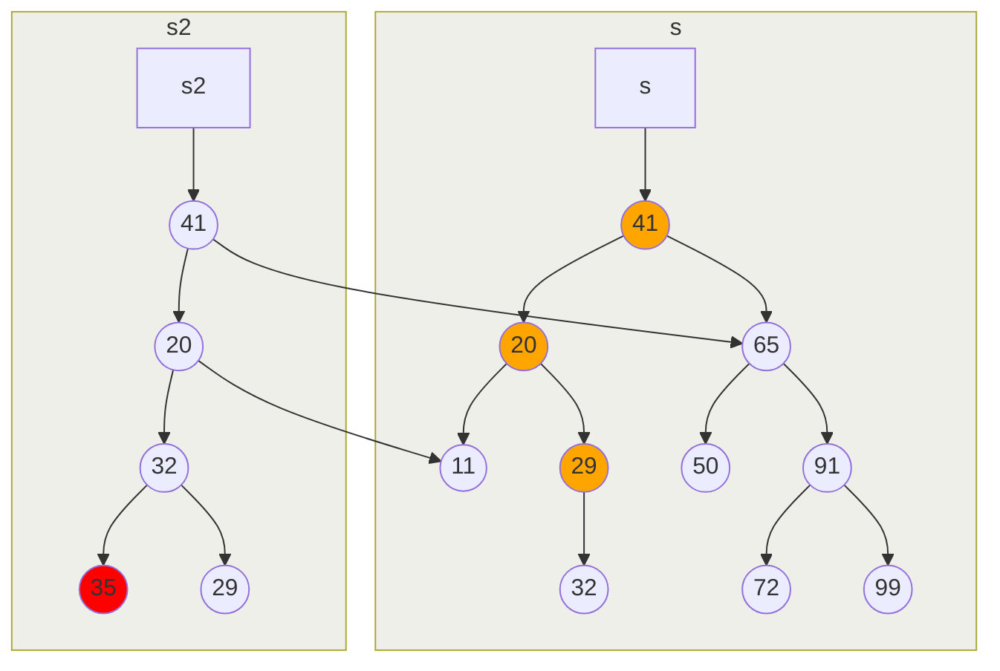
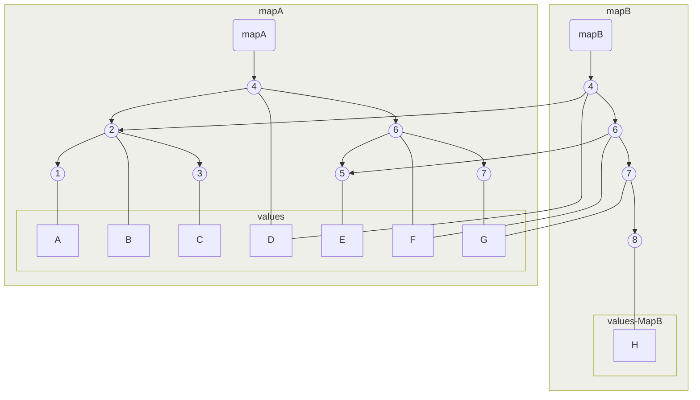

---

## Insert - structural sharing

```fsharp
let s2 = s |> Set.add 35
```



---

## Map sharing

```fsharp
let mapA = Map.ofList [1, "A"; 2, "B"; 3, "C"; 4, "D"; 5, "E"; 6, "F"; 7, "G"]
let mapB = Map.add 8 "H" mapA
```
<Transform :scale="0.7">



</Transform>
