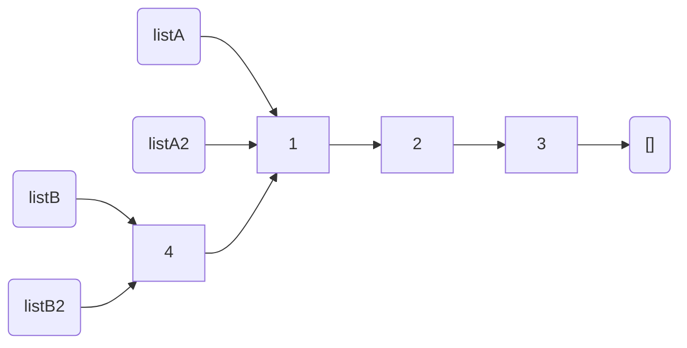
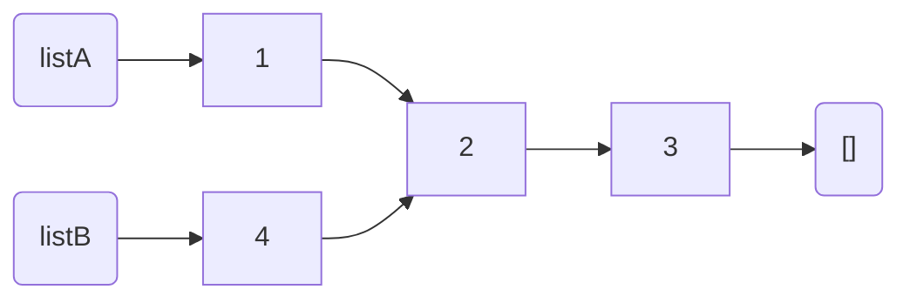
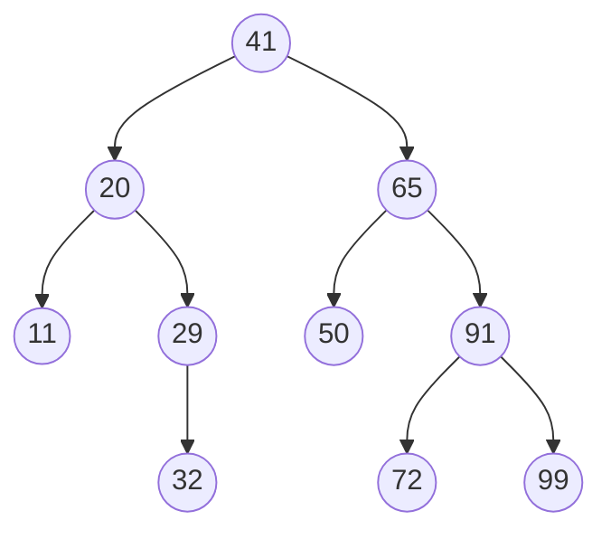
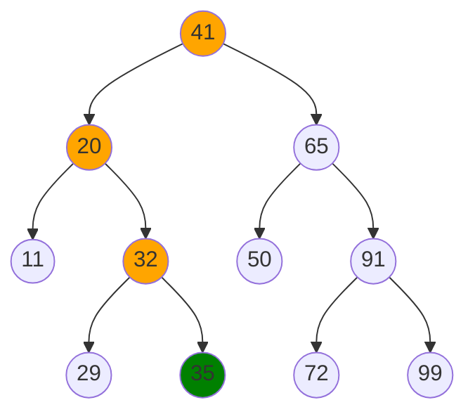
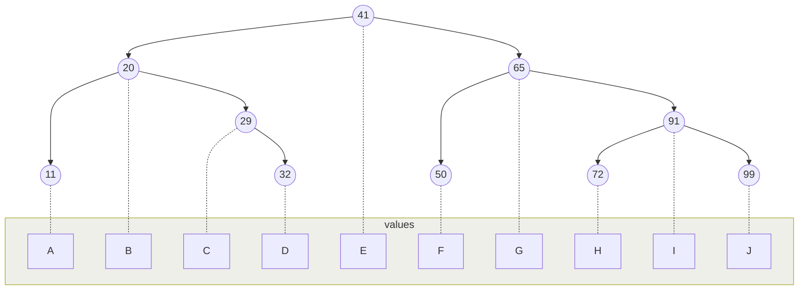
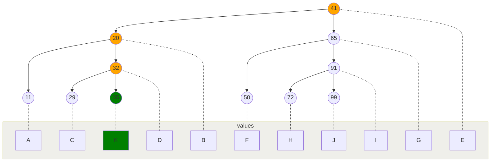

::date::
DevTalks 18.10.2024

::title::
# Immutable Data Structures

::description::
<div><strong>Jindřich Ivánek</strong></div>
<div>F# Expert at Ciklum</div>
<div><a href="jindraivanek.hashnode.dev">jindraivanek.hashnode.dev</a></div>

<!--
Note
-->

---

# Immutable Data

## Definition
* no part of object can be changed after it's created

## Why use them?

<v-clicks>

- mutation is a common source of bugs
- immutable data are easier to reason about
  - value passed to a function, can't be changed
  - easier refactoring
- immutable data structures are **thread-safe**
- bonus: memory efficient time travelling

</v-clicks>

<!--
What's Immutable data? One of definitions is that no part of the object cannot be changed after it's creation. That gives us many advantages.

Mutation is common source of bugs. Procedures changing data are order dependent and harder to refactor.

Immutable data are easier to reason about. Value passed to a function can't be changed - big part of uncertainty disappear.

Maybe most important: immutable data is thread-safe, no race condition possible.

As a bonus we got the ability to store history of changes in memory efficient way.

-->

---

# Why immutability - example

<v-clicks>

<!-- ### Mutable -->
```csharp {2|5|3-6|8-9|all}
public class Account {
    public decimal Money { get; set; } // mutable data
    public void Pay(decimal amount) // race condition
    {
        Money -= amount; // change of value, no rollback, history
    }
}
var account = new Account { Money = 1000 };
Parallel.For(0, 10, _ => account.Pay(100)); // anything between 0 - 900
```

<!--

### Immutable
```fsharp {1-2|4-6|all}
type Account = { Money: decimal } // immutable data
let pay (account: Account) amount = { account with Money = account.Money - amount }

let account = { Money = 1000 }
[ 0 .. 10 ] |> List.map (fun i -> async { return pay account 100 }) 
|> Async.Parallel |> Async.RunSynchronously // 900 for all results
```
-->

</v-clicks>

---

# Immutable update
MYTH: to "change" immutable value, you need to copy the whole thing

<Transform :scale="0.7">

</Transform>

<!--

There is common misconception that for every small update of immutable data we need to copy all the data and then make the change. And that making immutable data slow and memory expensive. That's not true, we can use clever data structures that can share parts of the structure between old and new value. And also it turns out that performance penalty is not that big.

-->

---

# How?
* we can share parts of the structure between old and new value
* **Structural sharing**


<!-- 
The trick is to use references inside the data structure to share parts of the structure.

In the rest of the talk I will show you two most common immutable data structures: linked list and set represented by balanced tree.
-->

---

# (Linked) list

```fsharp
let listA = [1; 2; 3]
let listA = 1 :: 2 :: 3 :: []
```


<!--
In linked list every item contains link to rest of the list.

We can insert new item only at front of list.

When we need to retrieve item at n-th position, we need to go through list.
-->

---

## (Linked) list sharing

```fsharp
let listA = [1; 2; 3]
let listA = 1 :: 2 :: 3 :: []
let listA2 = listA
let listB = 4 :: listA
let listB2 = [4] @ listA
```

<!--  -->



<!--
When we append new item to list, we just link to original list from new item. Old list reference is still valid.

List don't have explicit functions to change item, instead we can go through sublists and link them to some new item.
-->

---

# List - update head

```fsharp
let listA = [1; 2; 3]
let listB = 4 :: List.tail listA
```



<!--
To change value of item, we create new item and link it to rest of list after original item.

To change value of item inside the list, we first split item into two parts, and join them with new item.
-->

---


<!--
Git in principle is just linked list (with few more features) and branches are just named references.  
-->

---
layout: two-columns
---

<style>
.small-code {
  --prism-font-size: 1em;
}
</style>

::left::

# List Benchmark

<div class="small-code">

```fsharp
member this.FsListWorkload() =
    this.listOfRecords
    |> List.map (fun x -> { x with Id = x.Id + 1})
    |> List.filter (fun x -> x.Id % 2 = 0)
    |> List.map (fun x -> int64 x.Id)
    |> List.sum

member this.CsListWorkload() =
    let csList = this.csList
    for i=0 to csList.Count - 1 do
        csList.[i] <- 
          { csList.[i] with Id = csList.[i].Id + 1 }
    csList.RemoveAll(fun x -> x.Id % 2 <> 0)
    let x = csList.Sum(fun x -> int64 x.Id)
    x
```

</div>

::right::

FsListWorkload compared to CsListWorkload

<Transform :scale="0.7">

| size   | Time Ratio | Memory Ratio |
| ------ | ---------: | -----------: |
| 100    |       1.41 |         2.54 |
| 1000   |       1.51 |         2.26 |
| 10000  |       1.61 |         2.16 |
| 100000 |       1.37 |         2.15 |

</Transform>

<!--
For benchmark, we create list of given size, filter out half of items and then sum all items.

We can see that immutable list is slower, but not much.
-->

---

# Notes on Benchmarks
<v-clicks>

- hard and time expensive to write correct benchmarks
- there are always ways to make them faster
- at best they are only indicative
- all benchmarks are wrong

</v-clicks>

---

# Set
- unordered set of values

- typically implemented as a balanced tree (AVL)

```fsharp
let s = [11; 20; 29; 32; 41; 50; 65; 72; 91; 99] |> set
```



<!--

Dictionary or Map are important data structure. We start by Set, Map is based on it.

Set is a structure that represent collection of unique items. It can answer if it contains some item. Duplicates are ignored. There is no ordering guarantee.

To enable structural sharing, we represent Set as tree. Unchanged subtrees are shared across instances.

The Set is typically represented as balanced binary tree (AVL tree).

-->

---

## Insert = search + add

```fsharp
let s2 = s |> Set.add 35
```


<font color="grey"> <p align="right">source: https://visualgo.net/en/bst</p></font>

<!--

To insert item to Set, we try to search for it in tree. If item is not found, we add it to tree to proper location. Then the tree is re-balanced.

-->


---

## Insert - structural sharing

```fsharp
let s2 = s |> Set.add 35
```



<!--

All unchanged part of the tree is shared. Sharing is done on subtree level. When subtree is not changed , reference ti it remains the same and it is shared between old and new instance.

-->

---

## Building new Set

```fsharp
let s = [1; 7; 3; 9; 5; 6; 2; 8; 4] |> set
```


<font color="grey"> <p align="right">source: https://visualgo.net/en/bst</p></font>

<!--

Let's see how building new Set by inserting items one-by-one looks like.

-->

---

# Set Benchmark
Immutable `Set` / mutable `HashSet`

<Transform :scale="0.7">

| Method              | size   | Time Ratio | Memory Ratio |
| ------------------- | ------ | ---------: | -----------: |
| 'create + contains' | 100    |       3.52 |         1.46 |
| 'create + contains' | 1000   |       4.32 |         1.82 |
| 'create + contains' | 10000  |       4.28 |         2.23 |
| 'create + contains' | 100000 |       3.02 |         2.72 |
| 'contains'          | 100    |       0.97 |         1.01 |
| 'contains'          | 1000   |       1.09 |         1.00 |
| 'contains'          | 10000  |       1.09 |         1.00 |
| 'contains'          | 100000 |       0.92 |         1.00 |

</Transform>

<!--

Immutable Set is on par with mutable HashSet for contains operation. It's slower for creation. That's because of need to rebalancing tree during inserts.

-->

---

# Map
- dictionary like immutable data structure
- like `Set`, but with value linked with each key (node)

<Transform :scale="0.7">



</Transform>
---

## Map sharing

```fsharp
let mapA = Map.ofList [11, "A"; 20, "B"; 29, "C"; 32, "D"; 41, "E"; 50, "F"; 65, "G", 72, "H"; 91, "I"; 99, "J"]
let mapB = Map.add 35 "K" mapA
```
<Transform :scale="0.7">



</Transform>

<!--

Values are linked to keys through references. That means that even if we changing keys, the (possibly big) values are shared.

-->

---

# Map Benchmark

Immutable `Map` / mutable `Dictionary`

<Transform :scale="0.7">

| Method                 | size   | Time Ratio | Memory Ratio |
| ---------------------- | ------ | ---------: | ------: |
| 'containsKey'          | 100    |       1.08 |    1.01 |
| 'containsKey'          | 1000   |       0.85 |    1.00 |
| 'containsKey'          | 10000  |       1.07 |    1.00 |
| 'containsKey'          | 100000 |       0.99 |    1.00 |
| 'create + containsKey' | 100    |       2.07 |    1.92 |
| 'create + containsKey' | 1000   |       2.98 |    2.21 |
| 'create + containsKey' | 10000  |       1.79 |    2.61 |
| 'create + containsKey' | 100000 |       2.19 |    3.13 |

</Transform>

---
layout: thank-you
---

# Thank you!

---

# Records

```fsharp
{ Id: int; Name: string; Data: BigObject }
```

- immutable by default
- no special immutable structure
- update syntax creates new record with not-changed fields shared with old record
  - ```fsharp
    { oldRecord with Name = "Bob" }
    ```
  - only reference is copied
  - `Data` is shared

---

# Structural comparison in .NET

- definition of equality based on values, not references
- all F# data types have defined structural comparison and ordering
- immutability and structural comparison are different features, but it is common that immutable data structures have defined structural comparison
  - same value with different references is more common when working with immutable data structures

---
title: 'Immutable Data Structures'
layout: intro
background: '/img/intro-immutable-tree.png'
---

::date::
DevTalks 18.10.2024

::title::
# Immutable Data Structures

::description::
<div><strong>Jindřich Ivánek</strong></div>
<div>F# Expert at Ciklum</div>
<div><a href="jindraivanek.hashnode.dev">jindraivanek.hashnode.dev</a></div>


